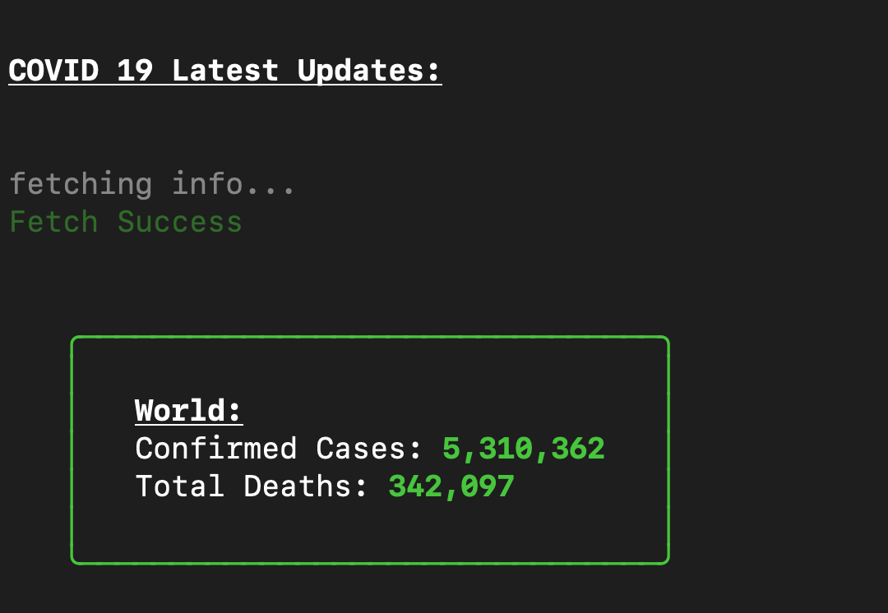

# covid-cli
COVID-19 Cli app


## Install
Install using npm

```
npm install prabakaranrvp/covid-cli
```

## Usage

`covid` Will get the COVID-19 Case updates from the world



`covid -l` Will list the available countries with country codes

`covid -c <country_code>` will get the latest COVID-19 Case updates on the given country


#### COVID DATA Realtime API Data Reference: https://github.com/ExpDev07/coronavirus-tracker-api
